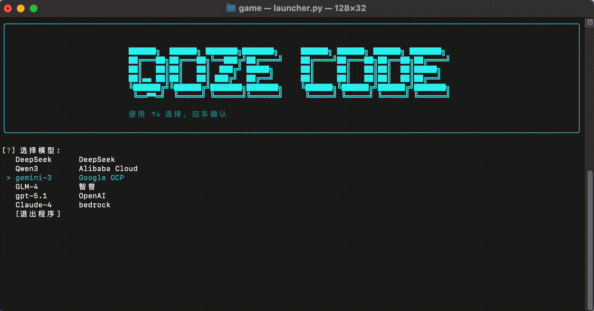
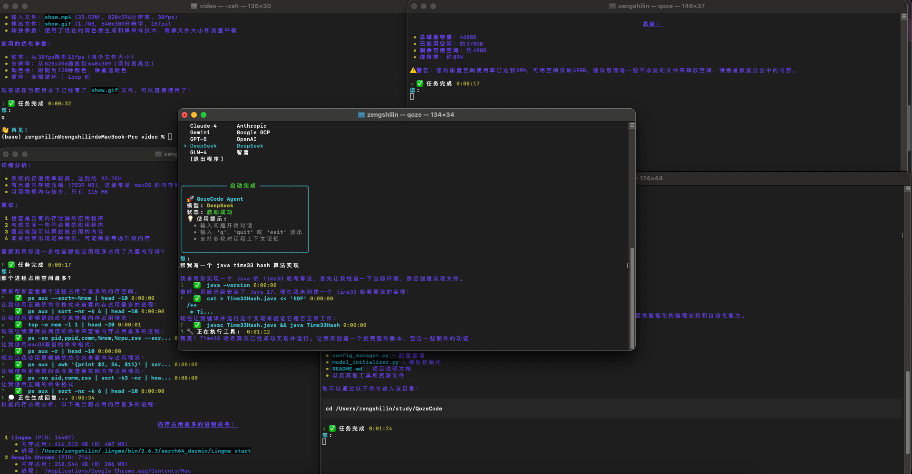
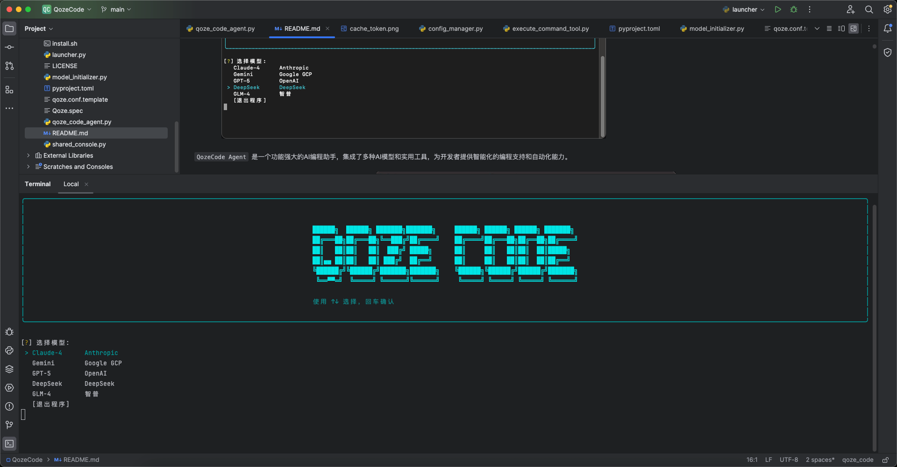
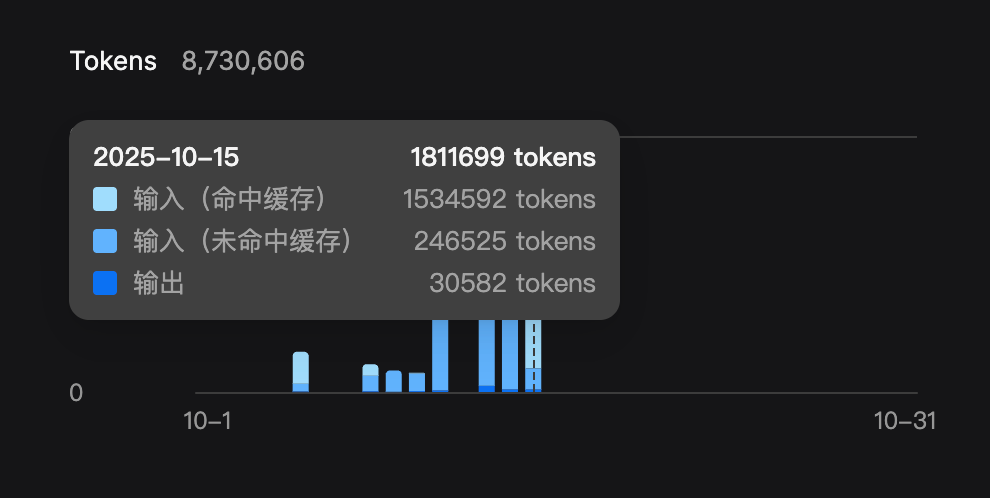
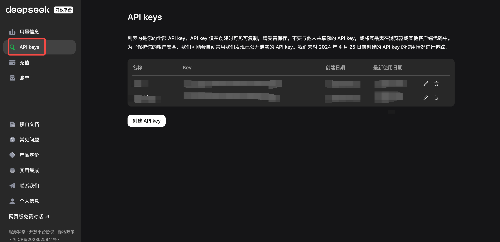
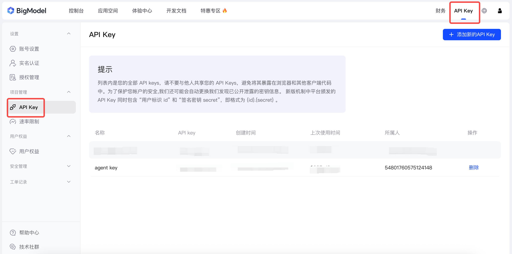

# QozeCode


```QozeCode``` 是一个功能强大的命令行AI agent，集成了多种AI模型和实用工具，为开发者提供智能化的编程支持和自动化能力。

<div align="center">
  
</div>

## 📚 目录

- [📦 目前集成模型厂商](#-目前集成模型厂商)
- [核心功能特性](#核心功能特性)
- [最佳使用建议](#最佳使用建议)
- [QuickStart](#quickstart)
    - [安装方式](#安装方式)
    - [配置指引](#配置指引)
        - [OpenAI](#1-openai)
        - [DeepSeek](#2-deepseek)
        - [智普](#3-glm-4-智谱ai)
        - [Claude](#4-claude-4-aws-bedrock)
        - [Gemini](#5-gemini-google-vertex-ai)
    - [使用方法](#使用方法)
- [许可证](#许可证)

#### 📦 目前集成模型厂商

| 模型名称         | 厂商                      | 状态     | 说明                           |
|--------------|-------------------------|--------|------------------------------|
| DeepSeek     | DeepSeek 官方             | 🟢 可用  | 支持 DeepSeek Exp V3.2         |
| Qwen Max     | Qwen 官方                 | 🟢 可用  | 支持 Qwen Max                  |
| Claude-4     | Anthropic (AWS Bedrock) | 🟢 可用  | 通过 AWS Bedrock 集成            |
| gpt-5.1      | OpenAI 官方               | 🟢 可用  | OpenAI GPT-5                 |
| gemini-3-pro | Google Vertex AI        | 🟢 可用  | 通过 Google Cloud Vertex AI 集成 |
| glm-4.6      | 智谱AI 官方                 | 🟢 可用  | 支持 GLM-4.6 模型                |
| Ollama       | 自建模型                    | 🔴 计划中 | 未来支持                         |

[//]: # (> ## 🤔 为什么不全模型集成？)

[//]: # (>)

[//]: # (> 在测试 Agent 期间，我们发现全模型支持会带来以下问题：)

[//]: # (>)

[//]: # (> ### 💡 设计理念)

[//]: # (> - **优化体验优先**：为了保证最佳的使用体验，我们选择性地集成在特定领域表现优异的模型)

[//]: # (> - **维护效率**：集中精力维护少数高质量模型，确保每个集成的稳定性和可靠性)

[//]: # (>)

[//]: # (> ### 📈 选型标准)

[//]: # (> 经过个人体验和分析，我们按照以下标准选择集成的模型：)

[//]: # (> - **代码生成能力**：在编程和代码生成方面表现优异)

[//]: # (> - **解决问题能力**：具备强大的逻辑思维和问题分析能力)

[//]: # (> - **API通畅**：提供稳定可靠的调用接口，或者能避免墙带来影响)

[//]: # (> - **性价比**：在使用成本和性能之间取得良好平衡)

[//]: # (>)

[//]: # (> 💬 如果您有特殊的需求，欢迎提出 [Issues]&#40;https://github.com/KylinShinlyLin/QozeCode/issues&#41;，我会尽快与您联系沟通！)

## 核心功能特性

[//]: # (### 多窗口 agent 同时运行)

[//]: # ()
[//]: # (- **并发处理**: 支持在多个终端窗口中同时启动不同的 QozeCode Agent 实例，每个实例拥有独立的会话ID和上下文记忆)

[//]: # ()
[//]: # (<div align="center">)

[//]: # (  )

[//]: # (</div>)

### 在IDE 中随时唤起执行

- **快速启动**: 通过简单的 `qoze` 命令即可在任意目录下启动 AI 编程助手，无需复杂配置

<div align="center">
  
</div>

[//]: # (### 🌐 浏览器自动化（计划中）)

[//]: # ()
[//]: # (- **网页操作**: 智能浏览器控制功能，可以自动化网页操作和数据抓取)

### 🔧 扩展能力 (未来支持)

- **MCP 工具支持**: 即将支持更多 Model Context Protocol 工具（coming soon）
- **API 集成**: 跟多高效有价值的工具会通过API持续集成

### 💰 高效缓存利用

- 优化过高效 token 缓存利用
- 运行一天需要 1 块钱人民币



#### 最佳使用建议

> 如果你考虑性价比并且还是国内用户， 建议你选择 ' deepseek ' 作为你的首选模型使用

# QuickStart

## 安装方式

- 安装 or 更新 直接执行

```bash
curl -fsSL https://raw.githubusercontent.com/KylinShinlyLin/QozeCode/main/install.sh | bash -s install
```

- 添加环境变量，方便使用

```bash
source ~/.qoze/qoze_env.sh && qoze
```

- 卸载

```bash
curl -fsSL https://raw.githubusercontent.com/KylinShinlyLin/QozeCode/main/install.sh | bash -s install
```

## 配置指引

### API 密钥配置

在使用 QozeCode Agent 之前，您需要配置相应AI模型的API密钥。配置文件位置：

- **优先位置**: `/etc/conf/qoze.conf` (需要管理员权限)
- **备用位置**: `~/.qoze/qoze.conf` (用户目录)

首次运行时，系统会自动创建配置文件模板。您也可以手动创建配置文件：

```bash
# 创建配置目录
mkdir -p ~/.qoze
```

### 📋 各模型配置说明

#### 1. OpenAI

```ini
[openai]
api_key=your_openai_api_key_here
```

**获取方式**:

- 访问 [OpenAI Platform](https://platform.openai.com/api-keys) 获取秘钥

#### 2. DeepSeek

```ini
[deepseek]
api_key=your_deepseek_api_key_here
```

**获取方式**:

- 访问 [DeepSeek 官网](https://platform.deepseek.com/)



#### 3. GLM-4 (智谱AI)

```ini
[ZHIPU]
api_key=your_zhipu_api_key_here
```

**获取方式**:

- 访问 [智谱AI开放平台](https://open.bigmodel.cn/)



#### 4. Claude-4 (AWS Bedrock)

```ini
[aws]
session_token=your_session_key
region_name=us-east-1
```

**获取方式**:

- 登录 [AWS 控制台](https://aws.amazon.com/console/)
- 搜索进入 bedrock
- API秘钥 -> 生成长期 API 秘钥

#### 5. Gemini (Google Vertex AI)

```ini
[vertexai]
project=your_gcp_project_id
location=us-central1
credentials_path=/path/to/your/service-account-key.json
```

**获取方式**:

- 本地安装 gcloud cli
- 授权登录你的 gcp 账号
- 搜索 Vertex AI API 并开启权限
- 直接即可使用

### 使用方法

安装完成后，在终端中直接运行：

```bash
qoze
```

## 许可证

本项目采用 Apache License 2.0 开源协议。详情请参阅 [LICENSE](LICENSE) 文件。

Copyright 2025 QozeCode

Licensed under the Apache License, Version 2.0 (the "License");
you may not use this file except in compliance with the License.
You may obtain a copy of the License at

    http://www.apache.org/licenses/LICENSE-2.0

Unless required by applicable law or agreed to in writing, software
distributed under the License is distributed on an "AS IS" BASIS,
WITHOUT WARRANTIES OR CONDITIONS OF ANY KIND, either express or implied.
See the License for the specific language governing permissions and
limitations under the License.