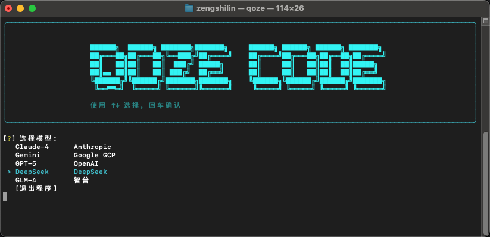

<div align="center">
    
    <h1>QozeCode</h1>
    <p><strong>智能终端工作空间助手 | Intelligent Terminal Workspace Assistant</strong></p>
</div>

---

## 项目简介

QozeCode 是一款基于 **LangGraph** 架构构建的专业级命令行智能体（AI Agent）。它旨在将大语言模型的推理能力与终端操作环境深度融合，通过
**ReAct**（Reasoning and Acting）范式，实现复杂开发任务的自动化执行。

作为开发者的智能副驾驶，QozeCode 不仅提供代码生成与审查能力，更能直接与系统 Shell 交互，执行文件操作、系统管理及网络检索，所有操作均在现代化的
TUI（终端用户界面）中呈现。

### 支持模型矩阵

QozeCode 深度集成了全球领先的 AI 模型厂商，为不同场景提供最佳算力支持：

| 厂商 (Provider)     | 支持模型 (Supported Models)           | 特性描述                 |
|:------------------|:----------------------------------|:---------------------|
| **OpenAI**        | `GPT-5.2` / `GPT-5.1`             | 强大的通用推理与代码生成能力       |
| **DeepSeek**      | `DeepSeek V3` / `DeepSeek R1`     | 卓越的推理性能与高性价比，支持深度思考  |
| **Anthropic**     | `Claude 4` (AWS Bedrock)          | 拥有超长上下文窗口与细腻的逻辑处理能力  |
| **Google**        | `Gemini 3 Pro` / `Gemini 3 Flash` | 谷歌最新多模态模型，响应速度极快     |
| **xAI**           | `Grok 4.1 Fast`                   | 极速推理，专注于实时信息处理       |
| **Zhipu AI**      | `GLM-4.7`                         | 优秀的中文理解能力与工具调用表现     |
| **Alibaba Cloud** | `Qwen 3 Max`                      | 通义千问最新旗舰，具备强大的逻辑思维能力 |

## 核心特性

### 🧠 智能决策引擎

基于 LangGraph 状态图构建的决策核心，支持复杂的任务规划与多步推理。系统严格遵循 ReAct 模式，确保每一个操作都经过"
思考-决策-执行-观察"的完整闭环，保证任务执行的准确性与可控性。

### 🖥️ 沉浸式终端体验

采用 **Textual** 与 **Rich** 框架打造的现代化终端界面，提供语法高亮、流式输出、面板分割等视觉增强功能。在保持命令行高效特性的同时，大幅提升交互体验与可读性。

### 🧩 模块化技能系统

拥有可扩展的技能（Skill）架构，支持按需加载专业领域的知识库与工具集：

- **Python Code Review**: 专业的代码质量分析、安全审计与重构建议。
- **Git Workflow**: 标准化的版本控制管理与协作流程指导。

### 🛠️ 全栈工具集成

内置多维度系统工具链，打破模型与操作系统的壁垒：

- **系统交互**: 安全执行 Shell 命令，管理文件系统。
- **信息检索**: 集成 Tavily API，提供实时的网络搜索与知识获取能力。
- **多模型支持**: 兼容 DeepSeek, GPT-4, Claude-3.5, Gemini Pro 等主流 LLM。

## 环境要求

- **操作系统**: macOS / Linux
- **Python 版本**: >= 3.9
- **终端环境**: 支持 True Color 的终端模拟器 (如 iTerm2, Alacritty, Terminal.app)

## 快速开始

### 1. 安装

#### 🚀 方式一：一键安装 (推荐)

使用 curl 命令快速部署到您的系统：

```bash
curl -fsSL https://raw.githubusercontent.com/KylinShinlyLin/QozeCode/main/install.sh | bash -s install
```

#### 📦 方式二：手动安装

如果您更喜欢手动管理代码仓库：

```bash
# 1. 克隆仓库
git clone https://github.com/KylinShinlyLin/QozeCode.git
cd QozeCode

# 2. 运行安装脚本
chmod +x install.sh
./install.sh
```

### 2. 配置

QozeCode 依赖配置文件管理 API 密钥与模型参数。请参考模板创建配置文件：

```bash
# 配置文件默认路径优先级：/etc/conf/qoze.conf > ~/.qoze/qoze.conf
cp qoze.conf.template ~/.qoze/qoze.conf
```

编辑配置文件，填入您的 API Key（如 OpenAI, DeepSeek, Tavily 等）。

### 3. 启动

在项目根目录下运行启动器：

```bash
python launcher.py
```

## 目录结构

```text
QozeCode/
├── .qoze/              # 运行时数据与规则库
├── skills/             # 技能插件模块
├── tools/              # 核心工具定义
├── utils/              # 基础架构组件
├── qoze_code_agent.py  # Agent 核心逻辑
└── qoze_tui.py         # 终端界面实现
```

## 开源协议

Licensed under the Apache License, Version 2.0 (the "License");
you may not use this file except in compliance with the License.
You may obtain a copy of the License at

    http://www.apache.org/licenses/LICENSE-2.0

Unless required by applicable law or agreed to in writing, software
distributed under the License is distributed on an "AS IS" BASIS,
WITHOUT WARRANTIES OR CONDITIONS OF ANY KIND, either express or implied.
See the License for the specific language governing permissions and
limitations under the License.